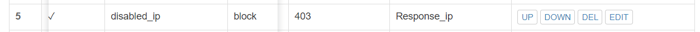
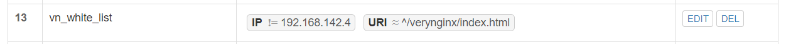
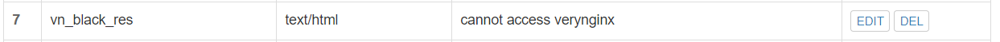

# exp0x05 高级Web服务器配置

## 实验基本描述

- 在一台主机（虚拟机）上同时配置Nginx和VeryNginx
  - VeryNginx作为本次实验的Web App的反向代理服务器和WAF
  - PHP-FPM进程的反向代理配置在nginx服务器上，VeryNginx服务器不直接配置Web站点服务
- 使用[Wordpress](https://wordpress.org/)搭建的站点对外提供访问的地址为： https://wp.sec.cuc.edu.cn
- 使用[Damn Vulnerable Web Application (DVWA)](http://www.dvwa.co.uk/)搭建的站点对外提供访问的地址为： http://dvwa.sec.cuc.edu.cn

## 实验环境

- 虚拟机
  - Ubuntu server 18.04
  - ip：192.168.142.3
  - 网卡：NAT+Host-only
  - wordpress监听端口：8080
  - dvwa监听端口：8090
  - verynginx监听端口：80
- 宿主机
  - Windows 10
  - ip：192.168.142.1

## 实验过程

### 基本要求部分

#### 1. 安装nginx

```bash
# 直接用apt下载安装即可
sudo apt update
sudo apt install nginx 
```

#### 2. 自签发证书配置

```bash
sudo openssl req -x509 -nodes -days 365 -newkey rsa:2048 -keyout /etc/ssl/private/nginx-selfsigned.key -out /etc/ssl/certs/nginx-selfsigned.crt
sudo openssl dhparam -out /etc/nginx/dhparam.pem 4096

# 配置nginx
sudo nano /etc/nginx/snippets/self-signed.conf
```


```bash
sudo nano /etc/nginx/snippets/ssl-params.conf
```


#### 3. 配置主机域名解析

- 修改C:\Windows\System32\drivers\etc\hosts

```
192.168.142.3	vn.sec.cuc.edu.cn
192.168.142.3	dvwa.sec.cuc.edu.cn
192.168.142.3	wp.sec.cuc.edu.cn
```

#### 4. 安装wordpress

```bash
# 安装mysql
sudo apt install mysql-server
sudo mysql_secure_installation
sudo mysql
# 添加root用户
ALTER USER 'root'@'localhost' IDENTIFIED WITH mysql_native_password BY 'password';	# 这里password需要满足当前密码安全要求，我为了方便用uninstall plugin validate_password命令无效了当前安全要求
FLUSH PRIVILEGES;
EXIT;

# 为wordpress创建mysql数据库及用户
CREATE DATABASE wordpress DEFAULT CHARACTER SET utf8 COLLATE utf8_unicode_ci;
GRANT ALL ON wordpress.* TO 'wordpressuser'@'localhost' IDENTIFIED BY 'password';
FLUSH PRIVILEGES;
EXIT;

# 安装php扩展包
sudo apt install php-curl php-gd php-intl php-mbstring php-soap php-xml php-xmlrpc php-zip
sudo systemctl restart php7.2-fpm

# config Nginx，这一步连着证书一起配置
sudo vim /etc/nginx/sites-available/wordpress
```


```bash
# 测试配置是否有误
sudo nginx -t
# 重启nginx
sudo systemctl reload nginx

# 下载wordpress
cd /tmp
curl -LO https://wordpress.org/latest.tar.gz
tar xzvf latest.tar.gz
cp /tmp/wordpress/wp-config-sample.php /tmp/wordpress/wp-config.php
sudo cp -a /tmp/wordpress/. /var/www/wordpress
sudo chown -R www-data:www-data /var/www/wordpress

# 修改wordpress配置文件
curl -s https://api.wordpress.org/secret-key/1.1/salt/	
# 将上一步命令行的输出复制到wp-config.php文件中，并在该文件中修改数据库的相关配置
sudo nano /var/www/wordpress/wp-config.php
```


```bash
# 因为我修改的不是nginx的default页面，所以要enable设置了wordpress的页面
sudo ln -s /etc/nginx/sites-available/wordpress /etc/nginx/sites-enabled/
# 重启nginx和php7.2-fpm服务
sudo systemctl restart nginx.service
sudo systemctl restart php7.2-fpm.service
```

- 安装结果


#### 5. 安装dvwa

```bash
# 为dvwa创建mysql数据库及用户
sudo mysql -u root -p
CREATE USER DVWA;
CREATE DATABASE dvwa;
GRANT ALL ON dvwa.* to DVWA@localhost identified by '123';
FLUSH PRIVILEGES;
EXIT;

# 下载DVWA
cd /var/www/
sudo git clone https://github.com/ethicalhack3r/DVWA.git

# config DVWA
cd DVWA
sudo cp config/config.inc.php.dist config/config.inc.php
sudo vim /etc/php/7.2/fpm/php.ini    # allow_url_include = Off -> On
sudo chmod 777 hackable/uploads/
sudo chmod 777 external/phpids/0.6/lib/IDS/tmp/phpids_log.txt
sudo chmod 777 config/
sudo vi config/config.inc.php   
# $_DVWA[ 'db_user' ] = 'DVWA';
# $_DVWA[ 'db_password' ] = '123';

# 重启php-fpm
sudo systemctl restart php7.2-fpm

# 在nginx中添加dvwa页面
sudo vi /etc/nginx/sites-available/dvwa
sudo ln -s /etc/nginx/sites-available/dvwa /etc/nginx/sites-enabled/

# 重启nginx
sudo systemctl restart nginx
```


- 安装结果


#### 6. 配置verynginx

- 网上垃圾教程害死人系列，一开始借鉴了某篇手动配置nginx和verynginx的教程，结果实验重来了两次:)
- 还是要看官方教程

```bash
# 下载verynginx
git clone https://github.com/alexazhou/VeryNginx.git

# 安装依赖
sudo apt-get install libpcre3 libpcre3-dev libssl-dev build-essential
sudo apt-get install libssl1.0-dev

# 安装verynginx
cd VeryNginx
sudo python install.py install

# 添加用户设置密码
sudo adduser nginx

# 启动verynginx
sudo /opt/verynginx/openresty/nginx/sbin/nginx

```

- 安装结果


#### 基本要求完成检测

- [x] 在一台主机（虚拟机）上同时配置Nginx和VeryNginx
- [x] 使用Wordpress搭建的站点对外提供访问的地址为： https://wp.sec.cuc.edu.cn
- [x] 使用Damn Vulnerable Web Application (DVWA)搭建的站点对外提供访问的地址为： http://dvwa.sec.cuc.edu.cn

### 安全加固要求部分

1. 反向代理设置

- Matcher


- Up Stream & Proxy


2. 使用IP地址方式均无法访问上述任意站点，并向访客展示自定义的**友好错误提示信息页面-1**

- Matcher、Response、Filter




- 结果


3. Damn Vulnerable Web Application (DVWA)只允许白名单上的访客来源IP，其他来源的IP访问均向访客展示自定义的**友好错误提示信息页面-2**

- Matcher、Response、Filter


- 用宿主机去访问dvwa


4. 在不升级Wordpress版本的情况下，通过定制VeryNginx的访问控制策略规则，**热**修复WordPress < 4.7.1 - Username Enumeration

- 未发现该漏洞


- 强行修改
- Matcher、Response、Filter


- 结果


5. 通过配置VeryNginx的Filter规则实现对Damn Vulnerable Web Application (DVWA)的SQL注入实验在低安全等级条件下进行防护

- Matcher、Response、Filter


- 结果


### VERYNGINX配置要求部分

1. VeryNginx的Web管理页面仅允许白名单上的访客来源IP，其他来源的IP访问均向访客展示自定义的**友好错误提示信息页面-3**

- Matcher、Response、Filter






- 通过宿主机访问verynginx


2. 限制访问频率

- Response、Frequency Limit


- 结果


3. 禁止curl访问

- Matcher、Response、Filter


- 结果


## 实验中遇到的问题

- 安装verynginx的时候一开始参考了网上的一篇定制nginx的中文教程，结果完全没有办法装好，然后就看了官方文档，done
- wp和dvwa我没有配置在nginx的默认页面default里，而是给它们分别新建了两个页面，这样DVWA的文件就不能放在/var/www/html/里，而是要放在/var/www/里，一开始这个路径没有配对dvwa一直装不好，后来参考了一篇配置nginx server block的英文教程，done
- 尝试给verynginx也搞个自签证书，和nginx用同一个，但是不知为何配不好，后来放弃了
- 总之这次实验还是比较坎坷，重来了好几次，最后熟练到让人心疼，中途电脑还坏了一次，心态差点崩了qwq

## 参考资料

- [how-to-install-linux-nginx-mysql-php-lemp-stack-ubuntu-18-04](https://www.digitalocean.com/community/tutorials/how-to-install-linux-nginx-mysql-php-lemp-stack-ubuntu-18-04)
- [install-wordpress-on-ubuntu-18-04-lts-bata-with-nginx-mariadb-and-php-fpm](https://websiteforstudents.com/install-wordpress-on-ubuntu-18-04-lts-bata-with-nginx-mariadb-and-php-fpm/)
- [how-to-create-a-self-signed-ssl-certificate-for-nginx-in-ubuntu-18-04](https://www.digitalocean.com/community/tutorials/how-to-create-a-self-signed-ssl-certificate-for-nginx-in-ubuntu-18-04)
- [change-nginx-http-server-port-on-ubuntu-16-04-17-10-18-04](https://websiteforstudents.com/change-nginx-http-server-port-on-ubuntu-16-04-17-10-18-04/)
- [how-to-install-wordpress-with-lemp-on-ubuntu-18-04](https://www.digitalocean.com/community/tutorials/how-to-install-wordpress-with-lemp-on-ubuntu-18-04)
- [how-to-setup-damn-vulnerable-web-app-lab-on-ubuntu-18-04-server](https://kifarunix.com/how-to-setup-damn-vulnerable-web-app-lab-on-ubuntu-18-04-server/2/)
- [linux-how-to/configure-nginx-server-blocks-ubuntu](https://linoxide.com/linux-how-to/configure-nginx-server-blocks-ubuntu/)
- [linux-2019-jckling](https://github.com/CUCCS/linux-2019-jckling/blob/7ec398f09bfe2a6d79eb4f928ba7deae09b8c170/0x05/%E5%AE%9E%E9%AA%8C%E6%8A%A5%E5%91%8A.md)
- [linux-2019-Cassie8888](https://github.com/CUCCS/linux-2019-Cassie8888/blob/fd23620a0033511464aaa375b85fb51d412ea140/linux05/%E5%AE%9E%E9%AA%8C%E4%BA%94.md)
- [linux-2019-yang5220](https://github.com/CUCCS/linux-2019-yang5220/blob/4f2e0c2ca919435b15bb8450d12b37379fbc40d6/lab5/lab5.md)

