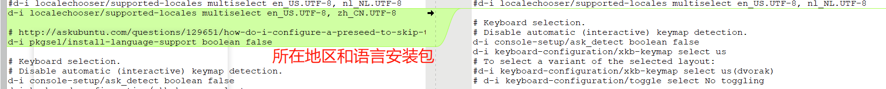

## exp0x01 无人值守Linux安装镜像制作

### 实验环境

- Virtualbox
- Ubuntu 18.04 Server（虚拟机）
- Windows10（宿主机）

### 实验问题

- 如何配置无人值守安装iso并在Virtualbox中完成自动化安装？
- Vitualbox安装完Ubuntu之后新添加的网卡如何实现系统开机自动启用和自动获取IP？
- 如何使用sftp在虚拟机和宿主机之间传输文件？

### 实验步骤

### 1、配置虚拟机网卡

- 第一块网卡：NAT

- 第二块网卡：Host-only

- 用vim打开网卡配置文件：`sudo vim /etc/netplan/01-netcfg.yaml`

- 使用`2yy`+`p`+`cw`命令修改文件，添加第二块网卡，结果如下：


- `wq!`强制保存退出

- 应用修改过后的配置：`sudo netplan apply`

- `ifconfig`查看结果：


### 2、ssh配置

- 虚拟机：`sudo apt-get install ssh`
- 因为宿主机上之前已经配置过ssh了，所以省略了公私钥配置的步骤，直接在命令行输入`ssh narthil@192.168.142.6`或者在putty输入`narthil@192.168.142.6`即可
- 一些比较长的命令行指令就直接从老师的教程里复制粘贴到宿主机的shell里了

### 3、iso镜像生成

- `wget`直接从教学网站的`ftp\iso`里down下来

  

```
# 在当前用户目录下创建一个用于挂载iso的文件目录。
mkdir loopdir
# 挂载iso镜像文件到这个目录。mount指令需要管理员权限，需要使用sudo
sudo mount -o loop ubuntu-16.04.1-server-amd64.iso loopdir
# 新建一个目录用于克隆光盘
mkdir cd
# 克隆光盘
rsync -av loopdir/ cd
# 卸载iso镜像
sudo umount loopdir
```

- 接下来，进入cd目录，进行无人值守安装的配置。vim打开isolinux/txt.cfg
- 将下列内容放在文件的开头，`default install`之后

```
# 添加以下内容到该文件后强制保存退出
label autoinstall
  menu label ^Auto Install Ubuntu Server
  kernel /install/vmlinuz
  append  file=/cdrom/preseed/ubuntu-server-autoinstall.seed debian-installer/locale=en_US console-setup/layoutcode=us keyboard-configuration/layoutcode=us console-setup/ask_detect=false localechooser/translation/warn-light=true localechooser/translation/warn-severe=true initrd=/install/initrd.gz root=/dev/ram rw quiet
```

- 保存后检查一下：`cat isolinux/txt.cfg`


- 配置seed文件

  - 下载老师提供的seed文件到宿主机
  - 使用sftp将seed文件放入虚拟机的`/cd/preseed`目录下
  - 可能会出现remote open(路径名): Permission Denied的情况，目标路径没有写权限，此时回到虚拟机，通过`sudo chmod -R 775 目标路径`开放写权限即可
  - 传输完成结果

  

- 修改`isolinux/isolinux.cfg`：

  

- 重新生成md5sum.txt：

  `find . -type f -print0 | xargs -0 md5sum > md5sum.txt`

  权限无法修改md5sum.txt的话使用`sudo chmod 777 md5sum.txt`或以`sudo`执行此指令

- 配置shell脚本

```
# 新建shell文件
sudo vim shell
# 添加以下内容到shell文件中
IMAGE=custom.iso
BUILD=~/cd/

mkisofs -r -V "Custom Ubuntu Install CD" \
          -cache-inodes \
          -J -l -b isolinux/isolinux.bin \
          -c isolinux/boot.cat -no-emul-boot \
          -boot-load-size 4 -boot-info-table \
          -o $IMAGE $BUILD
# 如果目标磁盘之前有数据，则在安装过程中会在分区检测环节出现人机交互对话框需要人工选择
# 执行shell命令
bash shell
# 上条指令执行时提示错误，安装genisoimage
sudo apt install genisoimage
```

- 执行`bash`指令之前，要安装`genisoimage`，输入指令`sudo apt-get install genisoimage`即可

- 执行`sudo bash shell`

  

- 宿主机通过pscp.exe从虚拟机下载custom.iso镜像

  ```
  # 使用pscp.exe进行下载
  pscp -l 用户名 -pw 密码 用户名@server:/home/用户名/cd/custom.iso 目标地址
  ```

### 4、结果

- 无人值守iso镜像安装录屏


## 文件对比

- 使用的软件是meld




## 遇到的问题

1. 安装ubuntu18.04server版的过程中keyboard detect出现了选择错误，导致判断错了我的键盘类型和语言，后来用vim的时候才发现输入的符号很奇怪，只能重装

2. 配置seed文件的时候踩了一个很大的坑，一开始是直接用`wget https://github.com/c4pr1c3/LinuxSysAdmin/blob/master/exp/chap0x01/cd-rom/preseed/ubuntu-server-autoinstall.seed `指令从网上下载seed文件，但是下载下来的文件实际上是个html文件，导致无人值守安装的过程报错

   

   这导致我反复做了4次本实验，一直以为是配置txt.cfg文件的时候出现的问题

3. 还有就是vim的使用问题，一开始怎么都没有办法退出，修改起来也很费劲，耽误了比较多时间

## 参考资料

- [FLYFLY-H](https://github.com/CUCCS/linux-2019-FLYFLY-H/blob/6f5af0c7475ac2a3485dbb00205a33569357707c/exp_1.md)

- [jackcily](https://github.com/CUCCS/linux-2019-jackcily/blob/fa19832c2b87d222253e81497053a18247401163/%E5%AE%9E%E9%AA%8C%E4%B8%80.md)

- https://blog.csdn.net/zhangxiao93/article/details/53677764

- https://www.digitalocean.com/community/questions/permission-denied-writing-files-through-sftp

  