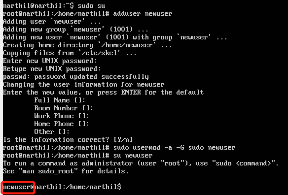
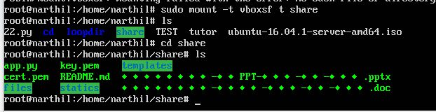

## exp0x03 开机自启动项管理

### 实验要求

- [Systemd入门教程：命令篇](http://www.ruanyifeng.com/blog/2016/03/systemd-tutorial-commands.html)
- [Systemd入门教程：实战篇](http://www.ruanyifeng.com/blog/2016/03/systemd-tutorial-part-two.html)
  - 同实验2，用asciinema录像

### 实验环境

- Ubuntu-18.04.1-server
  - 网卡配置：NAT、Host-only
- Windows10

### 实验过程与结果

1. **系统管理**
   - https://asciinema.org/a/6llnnKPb1YTIRfJARbWuuV57e
2. **Unit**
   - https://asciinema.org/a/OmEcKrrdyxEE8xtl3I6zfgZ8A
3. **Unit的配置文件**
   - https://asciinema.org/a/YTrkz8pGXLrwFkYC3xy8cjDBu
4. **Target**
   - https://asciinema.org/a/3LiagqUNZEILc4LhPSUAH23hQ
5. **日志管理**
   - https://asciinema.org/a/tRXXR2F0lK5hzPt8Bf605TZVg
6. **实战篇**
   - https://asciinema.org/a/alkKT6gMKuYUsmFl8N5fV8l5u

### 实验遇到的问题

- 命令篇中的一些配置文件的路径不对，要用`whereis`命令查看正确文件位置

### 参考资料

- [Systemd入门教程：命令篇](http://www.ruanyifeng.com/blog/2016/03/systemd-tutorial-commands.html)
- [Systemd入门教程：实战篇](http://www.ruanyifeng.com/blog/2016/03/systemd-tutorial-part-two.html)
- https://gist.github.com/estorgio/1d679f962e8209f8a9232f7593683265

### 自查清单

- 如何添加一个用户并使其具备sudo执行程序的权限？

  ```
  sudo su
  adduser newuser
  sudo usermod -a -G sudo newuser
  ```

  

- 如何将一个用户添加到一个用户组？

  ```
  sudo usermod -a -G usergroup username	#usergroup用户组名，username用户名
  ```

- 如何查看当前系统的分区表和文件系统详细信息？

  - `sudo fdisk -l`
  - `cat /etc/fstab`

- 如何实现开机自动挂载Virtualbox的共享目录分区？

  - 在Virtual box界面，`设置->共享文件夹`，选定宿主机上的共享文件夹

  - 启动虚拟机

  - 点击`设备->安装增强功能`

  - 输入指令：`sudo mount /dev/cdrom /media/cdrom`，挂载CD

  - 安装增强功能

    - ```
      sudo apt-get update
      sudo apt-get install build-essential linux-headers-$(uname -r)
      sudo /media/cdrom/./VBoxLinuxAdditions.run
      ```

  - 重启虚拟机：`sudo shutdown -r now`

  - 创建共享目录：`mkdir ~/shared`

  - 挂载共享目录：`sudo mount -t vboxsf shared ~/shared`

  

- 基于LVM（逻辑分卷管理）的分区如何实现动态扩容和缩减容量？

  ```
  lvdisplay	# 逻辑卷信息
  sudo lvextend -L +4g foo/bar	# 对foo卷组所对应的bar逻辑卷添加4GB大小
  sudo lvextend -L -4g foo/bar	# 对foo卷组所对应的bar逻辑卷减少4GB大小
  sudo resize2fs /dev/foo/bar
  ```

- 如何通过systemd设置实现在网络连通时运行一个指定脚本，在网络断开时运行另一个脚本？

  - 修改NetworkManager.service配置文件的service区块，修改`ExecStartPost`及`ExecStopPost`字段，分别改为对应配置文件的路径及名称

- 如何通过systemd设置实现一个脚本在任何情况下被杀死之后会立即重新启动？实现**杀不死**？

  - 将该脚本的配置文件中的service区块的`restart`字段值设置为`always`