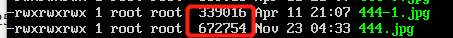

# exp0x04

## 实验要求

- 任务一：用bash编写一个图片批处理脚本
- 任务二：用bash编写一个文本批处理脚本，进行批量处理完成相应的数据统计任务

## 实验环境

- Ubuntu-18.04-server
- Windows10

## 实验过程

### 任务1

- 挂载共享文件夹，在宿主机上的某个文件夹中准备实验用图片

- 支持对jpeg格式图片进行图片质量压缩

  

- 支持对jpeg/png/svg格式图片在保持原始宽高比的前提下压缩分辨率

  

  - 这里要通过`sudo apt install imagemagick`下载`magick`工具使用`convert`

- 支持对图片批量添加自定义文本水印

  

- 支持批量重命名（统一添加文件名前缀或后缀，不影响原始文件扩展名）

  

  

- 支持将png/svg图片统一转换为jpg格式图片

  

### 任务2-1

### 任务2-2

https://asciinema.org/a/swMpDV0LLlHI4enhHQL4Gfjbb

## 实验中遇到的问题

- 图片处理的文件路径问题，一开始执行文件发现没有变化，退出当前目录之后发现改动后的文件都在外面

  

## 参考资料

- https://github.com/CUCCS/2015-linux-public-BurnyMcDull/tree/master/%E7%AC%AC%E5%9B%9B%E6%AC%A1%E5%AE%9E%E9%AA%8C
- https://github.com/CUCCS/2015-linux-public-songyawen/tree/master/exp4
- https://github.com/CUCCS/2015-linux-public-tyushua1/pull/3
- http://www.ruanyifeng.com/blog/2018/11/awk.html
- https://www.howtogeek.com/109369/how-to-quickly-resize-convert-modify-images-from-the-linux-terminal/
- https://www.jianshu.com/p/45d35f4ebc03
- https://www.jianshu.com/p/87b54bb5fcaa

